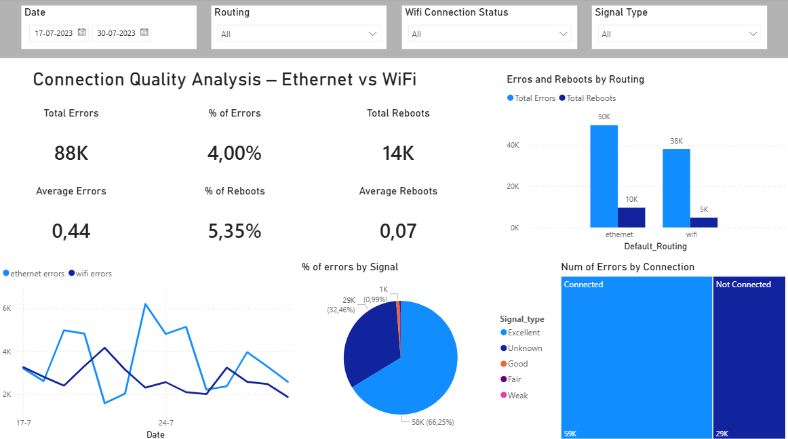

# Power BI – Connection Quality Analysis

## Problem Statement
This project analyzes service quality indicators from a set of devices connected to the network via Ethernet and/or WiFi.
The objective is to compare the different connection states in order to determine which routing option delivers the best performance and should be implemented as the default configuration.

## Dashboard Preview

## Dataset
- Time period: July 17 to July 30
- Metrics: Errors, Reboots, RSSI, Connection Type
- All devices share the same brand and model

## Approach
- Data cleaning and type validation using Power Query
- Handling missing RSSI values through flagging and categorical classification
- Comparative analysis by:
  - Connection type (Ethernet vs WiFi)
  - Signal quality levels
  - Temporal trends

## Key Findings
- Ethernet shows better performance across connected signal categories (Excellent, Good, Fair, Weak)
- WiFi presents higher error counts, especially under strong signal conditions
- Weaker signals show instability over time for both routing types
- The “Unknown” signal category represents 34% of the data and requires further investigation

## Conclusion
Based on connected devices only, Ethernet is the recommended routing option to be implemented by default.
However, the Unknown signal category significantly impacts the overall scenario and should be further analyzed.

## Deliverables
- Interactive Power BI dashboard (`.pbix`)
- Analysis report (PDF)
- Source dataset (CSV)
